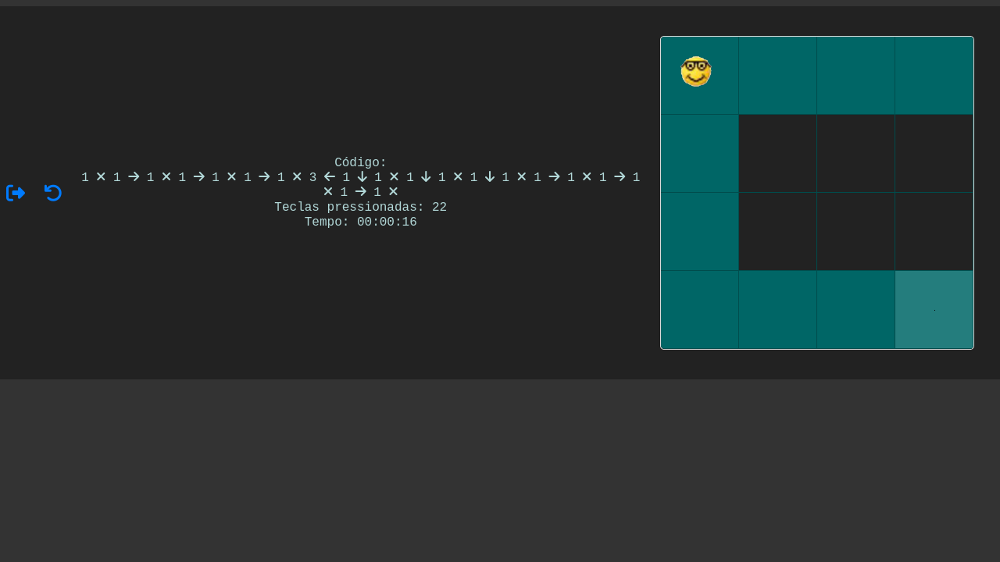

# GridMaster



## Overview

This web game project is an interactive sandbox grid-based game. It allows players to move and interact with a grid environment. The project is built using Vite and managed with PNPM.

## Getting Started

To get started with the game, follow these steps:

### Prerequisites

- [Node.js](https://nodejs.org/) (v14 or higher)
- [PNPM](https://pnpm.io/)
- [Vite](https://vitejs.dev/)

### Installation

1. Clone this repository to your local machine:

```bash
git clone https://github.com/RedsonBr140/GridMaster.git
```

2. Change to the project directory:

```bash
cd sandbox-grid-game
```

3. Install project dependencies using PNPM:

```bash
pnpm install
```

### Running the Game

1. Start the development server:

```bash
pnpm dev
```

2. Open your web browser and navigate to http://localhost:3000 to play the game.

### Features

- Interactive grid-based gameplay.
- Player movement and interaction with the grid.
- Time elapsed and keys pressed tracking.

### Contributing

We welcome contributions to improve this game. If you'd like to contribute, please follow our Contribution Guidelines.
License

This project is licensed under the MIT License. See the LICENSE file for details.

### Contact

For inquiries or support, please contact Your Name.

---

:heart: Enjoy playing GridMaster!
